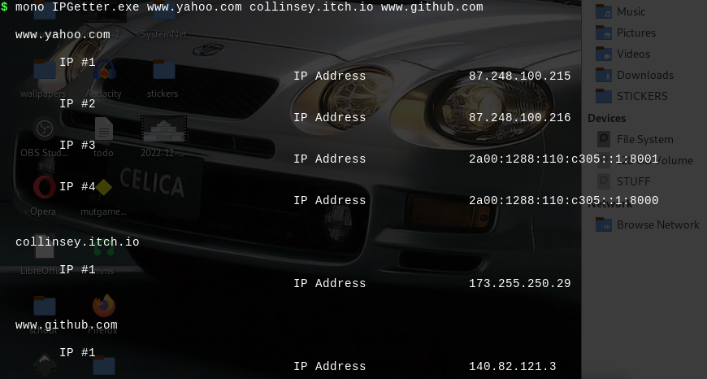

# WHAT
cli tool to get ip address(es) of provided hostname(s).

# HOW TO RUN
To check ip addresses of a given hostname use the tool in the following syntax : 

<h3> Windows </h3>
<code>
IPGetter.exe <hostname #1> <hostname #2> <hostname #3> <hostname #....>
</code>

<h3> Linux </h3>
I recommend the linux mono sdk to run the project build .
Get mono sdk from <a href="https://www.mono-project.com/ target="blank"">mono-project.com</a>
Use mono command to run the already compiled IPGetter.exe assembly in the root of the project.
 

<code>
mono IPGetter.exe <hostname #1> <hostname #2> <hostname #3> <hostname #....>
</code>

 

Where hostname is a valid Dns domain name that points to a valid ip address.

# HOW TO COMPILE 
Assuming you have mono sdk installed , use mcs command in the cli to compile the project.
The only file to compile is IPGetter.cs file.
 
<code>
mcs IPGetter.cs <name of the output assembly>
</code>

